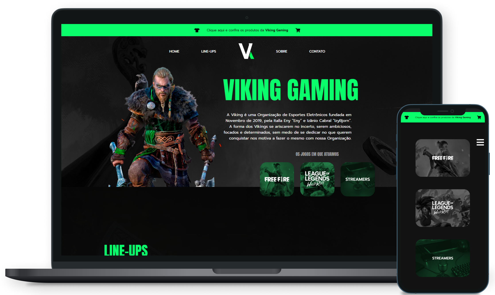

<h1 align="center">Viking Gaming NextJS Clone</h1>

<p align="center"><strong>In production: <a href="https://vikinggamingsite-clone.vercel.app/">vikinggamingsite-clone.vercel.app</a></strong></p>

<br>



<br>

<p align="center">Working as a freelance web designer, I developed a wordpress website for the e-sports organization Viking Gaming (the vikinggaming.gg). With NextJS, for study purposes, I decided to recreate the entire static website and add new features and layout behaviors to make it more beautiful, safe, performative, optimized and responsive. The project was hosted in Vercel and are available in the url: "vikinggamingclone.vercel.app"</p>

<br>

## **About The Project**

As its an institutional site for an e-sports organization, it is a completely static site with a lot of focus on HTML and CSS (created with Sass). The "Home" and "About" pages are pure content pages that explain and captivate a visitor by introducing the team;

The "Line-Ups" page has the objective of showing the different lineups and modalities that the org works, being a more dynamic page that changes the players in the session from the modality chosen in a selector by the user. Player rendering uses a base component and is done by consuming static data provided by a .json file;

The "Contact" page is a form and social media page and has functionality to send emails with user responses in the form by calling the nextjs api endpoints and consuming a rest api from the <a href="https://www.emailjs.com/">EmailJS</a> sending email service;

<br>

### Built With:

- []()JavaScript
- []()HTML5
- []()SCSS Modules
- []()ReactJS
- []()**NextJS**

   <br>

## **Getting Started**

To get a local copy up and running follow these simple steps.

### Prerequisites

This is an example of how to list things you need to use the software and how to install them.

- npm
  ```sh
  npm install npm@latest -g
  ```

### Installation

1. Clone the repo
   ```sh
   git clone https://github.com/github_username/repo_name.git
   ```
2. Install NPM packages
   ```sh
   npm install
   ```
   ```sh
   yarn
   ```

<br>

## Usage

### Environment Variables

First of all, for the email sending functionality to run correctly, you will need to create a .env.local file and set the environment variables:

- []()EMAIL_SERVICE_ID
- []()EMAIL_TEMPLATE_ID
- []()EMAIL_USER_ID
- []()EMAIL_RECIPIENT
- []()EMAIL_ACCESS_TOKEN

To your own keys and tokens and understand better the use of this variables, checkout the "src/pages/api/form.js" file and the EmailJs docs: <a href="https://www.emailjs.com/docs/rest-api/send/">https://www.emailjs.com/docs/rest-api/send/</a>

<br>

### Running locally
```sh
   npm run dev
```
```sh
   yarn dev
```
<br>

## License

Distributed under the Creative Commons Legal Code. See `LICENSE` for more information.

## Contact

Pedro Almeida - pedroalmeid@ignos.com.br
